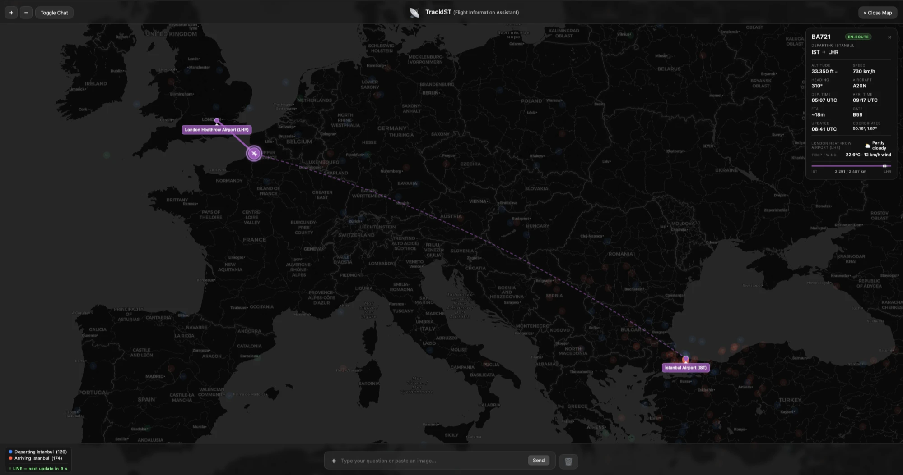
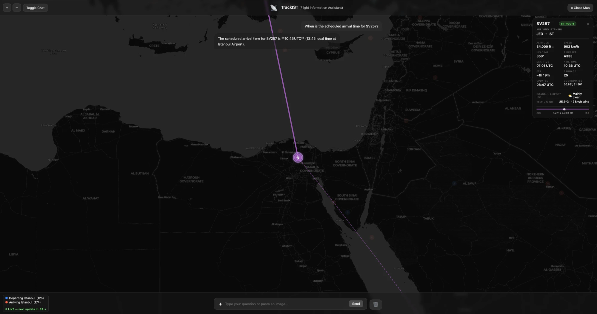

# TrackIST ✈️

Real-time flight tracking and a conversational AI assistant for **Istanbul Airport (IST)**.
Ask it anything about IST traffic — in Turkish or English — from *"TK12 nerede?"* to
*"What's the weather in the departure city of the highest flight right now?"*, or just
snap a photo of your boarding pass and let it find your flight.



## What it does

- **Live map** (Leaflet) — every IST arrival/departure with position, heading, and route;
  terminal-building overlay when you zoom into IST; ground-traffic view from ADS-B.
- **Conversational agent** (LangGraph ReAct) — 15 tools over live flight data: status,
  gates, baggage belts, delays, schedules with airport-local times, route progress,
  seat-map lookup, live weather, and a guarded text-to-SQL fallback for everything else.
- **Boarding-pass reading** — upload a photo; a vision model extracts the flight, gate and
  seat, and the chat picks it up as context ("is my seat a window seat?").
- **Answers in your language** — deterministic Turkish/English detection enforces the
  reply language per message; Turkish is understood with or without diacritics
  (*"en yuksekte ucan ucak"* routes the same as *"en yüksekte uçan uçak"*); time zones
  are computed in code (never by the LLM).



## Architecture

```
AirLabs API (hourly)          OpenSky ADS-B (every 60s)
  /flights  /schedules          live positions + landed detection
        │                              │
        ▼                              ▼
   workers/poller.py          workers/opensky_position.py
        └──────────────┬───────────────┘
                       ▼
                 PostgreSQL (flights)
                       │
        ┌──────────────┴───────────────┐
        ▼                              ▼
  Flask API (app.py)          LangGraph ReAct agent (agent/motor.py)
  map · routes · weather       15 tools · TR/EN · SSE streaming
                                       │
                     LLM provider chain with quota-aware failover:
                     Cerebras → Gemini → Mistral → Cohere → Groq
                     → LLM-free raw-data answers as the last resort
```

The provider chain is the interesting part: every provider is free-tier, and each failure
is classified rather than bubbled up. A rate-limit or overload (429/503) benches the
provider for a cooldown matched to the bucket that tripped — per-minute limits recover in
~75s, daily/monthly ones back off for 30 min — so a burst on one provider never takes the
product down. Failover is immediate: the SDKs' own retry/backoff is disabled (a single
in-SDK retry could otherwise sleep on a provider's `Retry-After` for a full minute), and
the chain *is* the retry. Provider-specific quirks are absorbed too — one model's malformed
history artifacts are sanitized out of the shared conversation thread before the next
provider sees it, so a single bad turn can't poison the thread. If *every* LLM is
unavailable, the most common intents (single flight, delays, arrivals/departures, airborne
count) are still answered from raw tool output.

## Quick start (Docker)

```bash
cp .env.example .env    # fill in your keys — see the table below
docker compose up --build
```

Open **http://localhost:5001**. `make down` stops everything, `make logs` tails logs.

## Environment variables

| Variable | Required | Used for |
|---|---|---|
| `AIRLABS_KEY` (+ optional `AIRLABS_KEY_2`) | ✅ | Flight/schedule data (poller) |
| `FLASK_SECRET_KEY` | ✅ | Session signing — `python -c "import secrets; print(secrets.token_hex(32))"` |
| `CEREBRAS_API_KEY` | at least one LLM key | Primary LLM (1M free tokens/day, [cloud.cerebras.ai](https://cloud.cerebras.ai)) |
| `GOOGLE_API_KEY` | ″ | Gemini ([aistudio.google.com/apikey](https://aistudio.google.com/apikey)) |
| `MISTRAL_API_KEY` | ″ | Mistral free Experiment plan ([console.mistral.ai](https://console.mistral.ai)) |
| `COHERE_API_KEY` | ″ | Cohere trial |
| `GROQ_API_KEY` | ″ | Groq free tier + boarding-pass vision model |
| `OPENSKY_CLIENT_ID` / `OPENSKY_CLIENT_SECRET` | optional | Higher OpenSky rate limits (anonymous works) |
| `GEMINI_MODEL`, `CEREBRAS_MODEL`, `MISTRAL_MODEL` | optional | Model overrides per provider |

The chain simply skips providers whose keys are missing.

## Evals — measuring the chatbot instead of guessing

`evals/` contains 27 golden questions (Turkish/English pairs across every feature) with
deterministic DB fixtures, scored on three axes: **content** (expected facts present),
**language** (answer matches the question's language) and **no-leak** (no chain-of-thought
in the answer).

```bash
python evals/run_evals.py --offline   # router + language detection, no LLM/DB needed
python evals/run_evals.py --seed      # load fixtures (WIPES the flights table — dev DB only)
python evals/run_evals.py --sleep 15  # live run against the real agent
```

Latest full run: **content 26/27 · language 27/27 · no-leak 27/27** (the one miss was an
over-strict expectation, since relaxed). The runner refuses to start on stale fixtures.

## Tests

```bash
python -m pytest test.py -v    # 108 tests, no live DB or API calls needed
```

Covers the SQL-injection guard, airport/timezone lookups, staleness logic (UTC-safe),
router classification incl. chain queries, language detection, and the DB query layer
against mocked connections.

## Running without Docker

Requires a local PostgreSQL (`createdb trackist && psql -d trackist -f init.sql`) and
`DATABASE_URL` in `.env`:

```bash
pip install -r requirements.txt
python workers/poller.py             # terminal 1 — flight data
python workers/opensky_position.py   # terminal 2 — live positions (optional)
python app.py                        # terminal 3 — http://localhost:5001
```

> Windows + Turkish locale note: initialize the cluster with `initdb --locale=C`
> (the default Turkish locale name contains non-ASCII characters and breaks initdb).

## Project layout

```
app.py                       Flask routes: chat (SSE), map API, boarding-pass analysis
agent/motor.py               ReAct agent, 15 tools, provider chain, streaming
agent/router.py              simple/complex routing (incl. chain-query detection)
agent/language.py            deterministic TR/EN detection → per-message language tag
agent/llm_state.py           shared provider cooldowns (429/503 classification)
tools/                       DB queries, statistics, text-to-SQL, weather, timezones
workers/poller.py            AirLabs → Postgres (hourly), status sanity correction
workers/opensky_position.py  OpenSky ADS-B → live positions (60s)
workers/cleanup.py           stale-flight removal, cross-checked against OpenSky
evals/                       golden dataset + fixtures + scorer
templates/ static/           chat UI + Leaflet map
```

## Honest limitations

- Positions are as fresh as the sources: 60s where OpenSky coverage exists, hourly
  otherwise. Arrival estimates are great-circle at current speed — treat as rough.
- All LLM providers run on free tiers; heavy traffic degrades gracefully to raw-data
  answers rather than failing, but sustained production use deserves one paid key.
- Single-table snapshot model: no historical tracks, one row per flight number.
